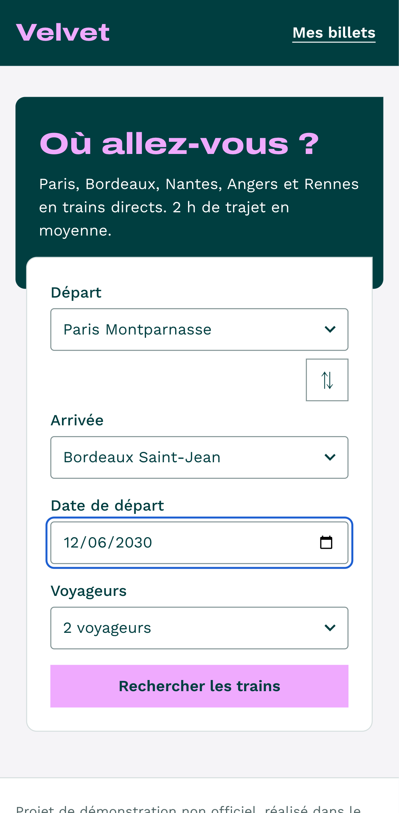
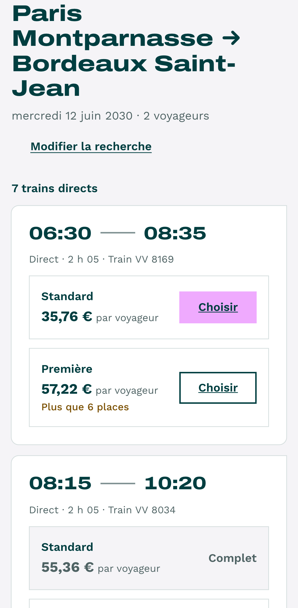
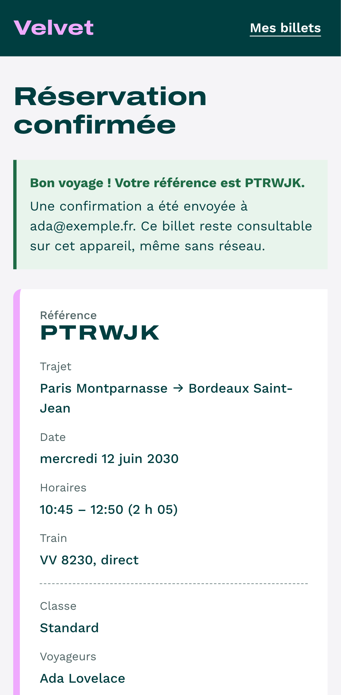
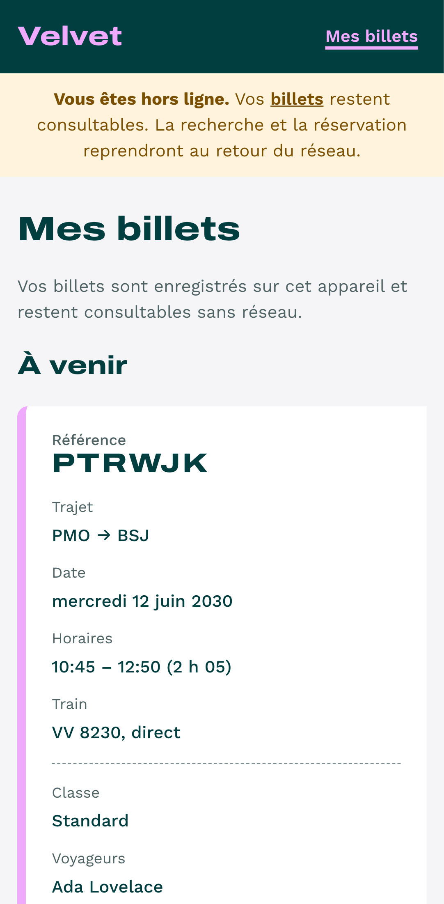

# Velvet · Réserver un train

Mini application de réservation de billets de train dans l'univers Velvet : recherche, réservation, billets consultables hors ligne.
Pensée pour un voyageur sur le quai ou dans le train : mobile d'abord, réseau instable, accessible au clavier et au lecteur d'écran.
React 19 + TypeScript strict, API simulée, testée de l'unitaire à l'end-to-end.

> Projet de démonstration non officiel, réalisé dans le cadre d'une candidature. Aucun lien avec Velvet ; ni logo ni photo officiels.

**Démo :** _lien Vercel à ajouter_ · **Code :** https://github.com/By-Kvn/velvet-booking

<p>
  
  
  
  
</p>

## Ce qu'il faut regarder

| Besoin du poste | Où le voir |
| --- | --- |
| Parcours voyageur | Recherche → résultats → réservation → confirmation → « Mes billets » |
| Appels API, validations, erreurs | `src/api/` : contrat Zod à l'exécution, erreurs typées, timeout, relances ciblées |
| Usages en mobilité | Bannière réseau, états hors ligne, PWA installable, billets sans réseau |
| Design system | `src/styles/tokens.css`, `src/components/ui/` : tokens uniquement, charte Velvet |
| Accessibilité | Focus au changement de page, erreurs reliées aux champs, audit axe sur chaque page |
| Cas limites et régressions | Double réservation, train complet au paiement, lien partagé expiré, stockage corrompu |
| Tests | 74 tests unitaires et composants (Vitest), 24 tests e2e mobile et desktop avec audit axe (Playwright), CI GitHub Actions |

## Tester les cas limites

Un sélecteur « Scénario de démo » est disponible en bas de chaque page. On peut aussi passer le scénario dans l'URL.

| Scénario | URL | Ce qui se passe |
| --- | --- | --- |
| Normal | `?scenario=default` | Tout fonctionne |
| Réseau lent | `?scenario=slow` | 3 s par requête : squelettes de chargement |
| Timeout | `?scenario=timeout` | Le serveur ne répond pas : « Le réseau est lent. Nouvelle tentative en cours. » puis erreur récupérable |
| Erreur serveur | `?scenario=error` | 500 : message clair et bouton « Réessayer » |
| Coupure réseau | `?scenario=network` | Requêtes en échec réseau |
| Trains complets | `?scenario=sold-out` | Toutes les classes complètes ; au paiement, 409 et retour aux résultats sans perdre la recherche |
| Contrat cassé | `?scenario=invalid-contract` | Le backend renvoie des données invalides : détectées par Zod, jamais affichées |

Autres cas à essayer :

- **Hors ligne** : DevTools > Network > Offline. Les billets restent consultables, la recherche et l'achat attendent le réseau.
- **Train complet** : Paris → Bordeaux, le train de 08:15 est complet en Standard.
- **Liaison non desservie** : Nantes → Rennes.
- **Lien expiré** : `/trajets?from=PMO&to=NTE&date=2020-01-01&passengers=1`.

## Lancer le projet

Node 24 (voir `.nvmrc`).

```bash
nvm use
npm install
npm run dev          # http://localhost:5173
npm test             # tests unitaires et composants
npm run test:e2e     # parcours complets + audit axe (build de production)
npm run typecheck && npm run lint
```

Pour brancher un vrai backend : `VITE_ENABLE_MOCKS=false`.

## Architecture

```
src/
  api/          client HTTP (timeout, erreurs typées), contrat Zod, appels trajets et réservations
  components/   ui/ (design system), layout/ (en-tête, footer, bannières)
  features/     search, trips, booking, tickets, stations : logique métier et composants par domaine
  pages/        une page par route, tests d'intégration sur l'application complète
  hooks/ lib/   titre de page, état réseau, formats (prix, heures de Paris, durées)
  mocks/        API simulée (MSW) : mêmes handlers dans les tests et dans la démo
e2e/            Playwright + axe, sur le build de production
```

## Choix techniques

Le détail et le « pourquoi » de chaque décision sont dans [`NOTES.md`](./NOTES.md). L'essentiel :

- **Vite plutôt que Next** : parcours interactif sans enjeu SEO, et le hors ligne est plus simple sur une SPA.
- **Le contrat d'API est validé à l'exécution (Zod)**, les types en sont déduits. Un backend qui casse le contrat est détecté tout de suite, au lieu de corrompre l'interface.
- **Erreurs typées** : chaque message dit quoi faire. React Query ne relance que les erreurs passagères (réseau, timeout, 5xx), jamais un achat.
- **L'URL est la source de vérité de la recherche** : lien partageable, bouton retour fiable, URL validée comme toute donnée externe.
- **Double réservation impossible** : bouton en chargement qui garde le focus, garde dans la soumission, aucune relance automatique. Un timeout à l'achat n'invite pas à recliquer.
- **Billets en localStorage revalidés par Zod à la lecture**, billet par billet : une donnée locale n'est pas fiable.
- **Hors ligne** : état réseau unique (celui de React Query), requêtes en pause expliquées puis reprises seules, achat bloqué plutôt que différé à l'insu du voyageur.
- **API simulée dans la page** plutôt que par le service worker de MSW : le seul service worker autorisé sur `/` est celui de la PWA.
- **Accessibilité** : composants natifs d'abord (`select`, radios, `input type="date"`), focus déplacé sur le titre à chaque navigation, erreurs jamais portées par la couleur seule, contrastes AA vérifiés sur la charte.
- **Charte Velvet** : vert et rose du site, le rose uniquement en fond (1.8:1 en texte sur blanc). RocGrotesk étant propriétaire, Archivo élargi la remplace.

## Limites connues

- Pas d'authentification : les billets sont liés à l'appareil.
- Pas de paiement : la réservation est confirmée directement.
- API simulée : les horaires sont générés, sans vraie disponibilité partagée.
- Un timeout à l'achat ne peut pas être levé sans backend : il faudrait une clé d'idempotence.

## Et ensuite

- Authentification OIDC et billets synchronisés entre appareils.
- Clé d'idempotence sur la réservation, pour pouvoir relancer un achat sans risque.
- Internationalisation (anglais) et monitoring des erreurs front (Sentry).
- Application « Agent de bord » : contrôle des billets par référence, hors ligne.
